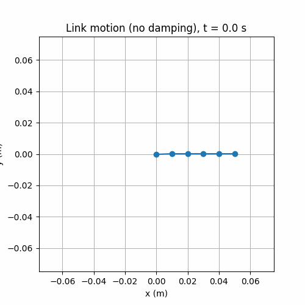
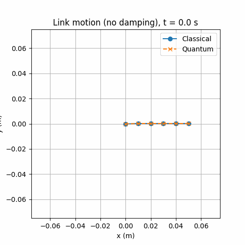
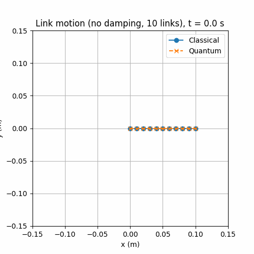
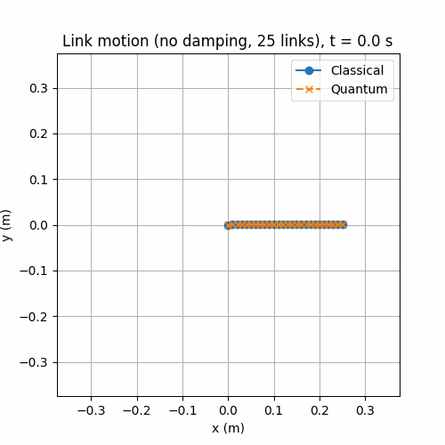
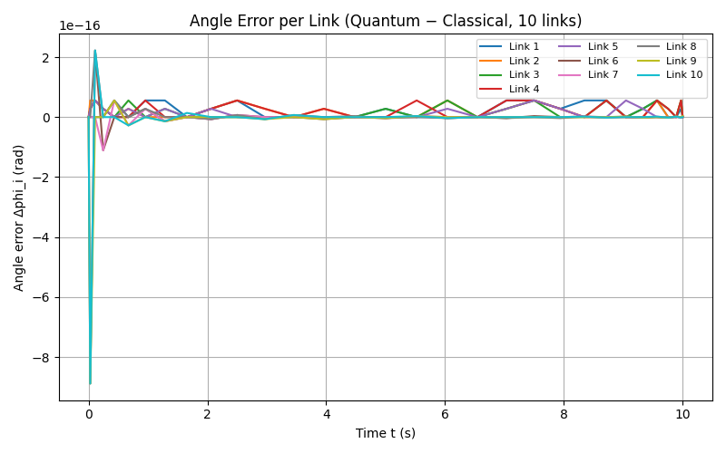
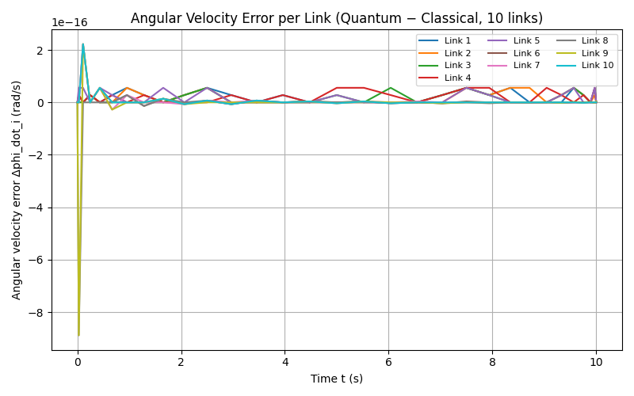
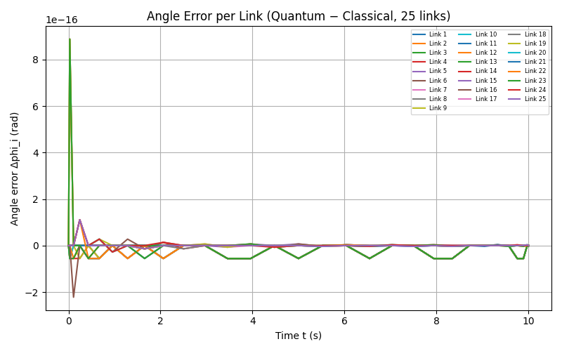
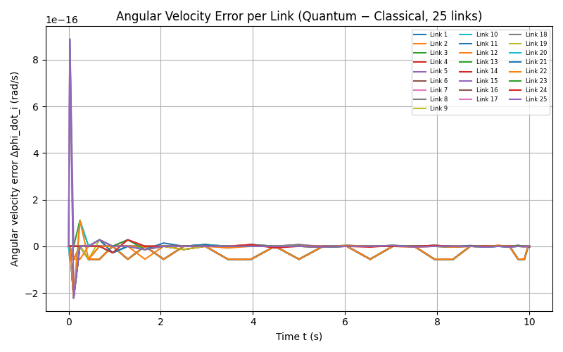

<h1>Quantum Spectral Solvers for Linearized Dynamics of Constant-Curvature Continuum Robots</h1>

<h2>CSCE 640 Quantum Algorithms</a></h2>

This repository implements <b>Chebyshev pseudospectral solvers</b> and 
<b>quantum-inspired amplitude encoding</b> to simulate the linearized
dynamics of constant-curvature continuum robots. It includes classical,
quantum-simulated, and hybrid solver tools for systems with 
<b>5, 10, and 25 links</b>.

The project demonstrates:

<ul>
  <li>Classical pseudospectral integration</li>
  <li>Quantum-inspired amplitude-encoded linear-system solutions</li>
  <li>Error analysis (global and per-link)</li>
  <li>Animated classical vs quantum motion</li>
  <li>Scaling for 5, 10, and 25 link systems</li>
</ul>

<h2>📁 Repository Structure & How to Run</h2>

<h3>1. classical_5.py — Classical 5-Link Simulation</h3>

Runs the classical dynamic model using Chebyshev pseudospectral integration.

<b>Run:</b> <code>python classical_5.py</code>

<h3>2. quantum_5.py — Quantum vs Classical Comparison (5 Links)</h3>
<ul>
  <li>Angle error per link</li>
  <li>Angular velocity error per link</li>
  <li>Classical vs quantum animation</li>
</ul>

<b>Run:</b> <code>python quantum_5.py</code>

<h3>3. quantum_10.py — 10-Link Quantum Simulation</h3>
<ul>
  <li>Global Δφ error plot</li>
  <li>Global Δφ̇ error plot</li>
  <li>Classical vs quantum animation</li>
</ul>

<b>Run:</b> <code>python quantum_10.py</code>

<h3>4. quantum_25.py — 25-Link Quantum Simulation</h3>
<ul>
  <li>Global Δφ error plot</li>
  <li>Global Δφ̇ error plot</li>
  <li>Classical vs quantum animation</li>
</ul>

<b>Run:</b> <code>python quantum_25.py</code>

<h2>🎞️ Saving GIF Animations</h2>

Each simulation file contains a commented GIF-saving line:

<pre><code># ani.save("link_motion_classical_5.gif", writer=gif_writer)</code></pre>

To enable GIF generation, simply uncomment it:

<pre><code>ani.save("link_motion_classical_5.gif", writer=gif_writer)</code></pre>

Install Pillow:

<pre><code>pip install pillow</code></pre>

<h2>🎥 GIF Animations</h2>

<h3>GIF 1 — Classical 5-Link Motion</h3>

<h3>GIF 2 — Classical vs Quantum (5-Link)</h3>

<h3>GIF 3 — Classical vs Quantum (10-Link)</h3>

<h3>GIF 4 — Classical vs Quantum (25-Link)</h3>

<h2>📊 Simulation Plots</h2>

<h3>Plot 1 — Angle Error Quantum vs Classical  (10-Link)</h3>

<h3>Plot 2 —  Angular Error Velocity Quantum vs Classical (10-Link)</h3>

<h3>Plot 3 — Angle Error Quantum vs Classical  (25-Link)<</h3>

<h3>Plot 4 — Angular Error Velocity Quantum vs Classical (25-Link)</h3>

<h2>📦 Dependencies</h2>

Install all required packages:

<pre><code>pip install numpy matplotlib pillow</code></pre>

<h2>⭐ Additional Notes</h2>

<ul>
  <li>All solvers use <b>Chebyshev–Gauss–Lobatto nodes</b> for spectral differentiation.</li>
  <li>Quantum-simulated results are produced using <b>amplitude encoding</b>, analogous to ideal QLSA output.</li>
  <li>Relative error is computed as:
    <pre><code>‖x_quantum − x_classical‖₂ / ‖x_classical‖₂</code></pre>
  </li>
  <li>10-link and 25-link models demonstrate scaling behavior.</li>
</ul>

